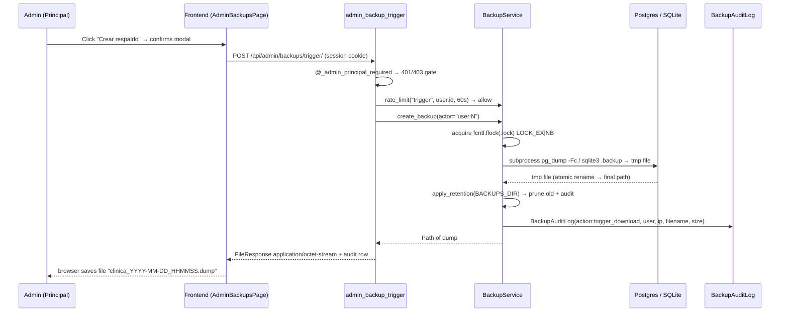
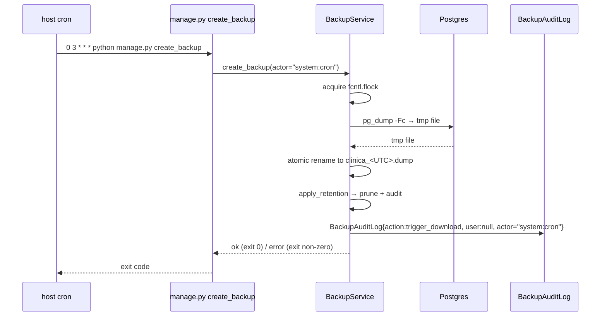
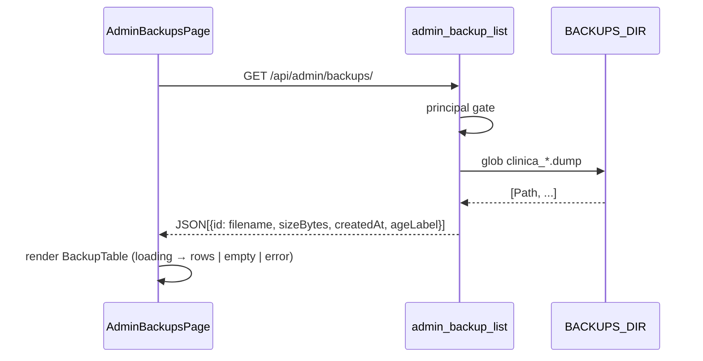
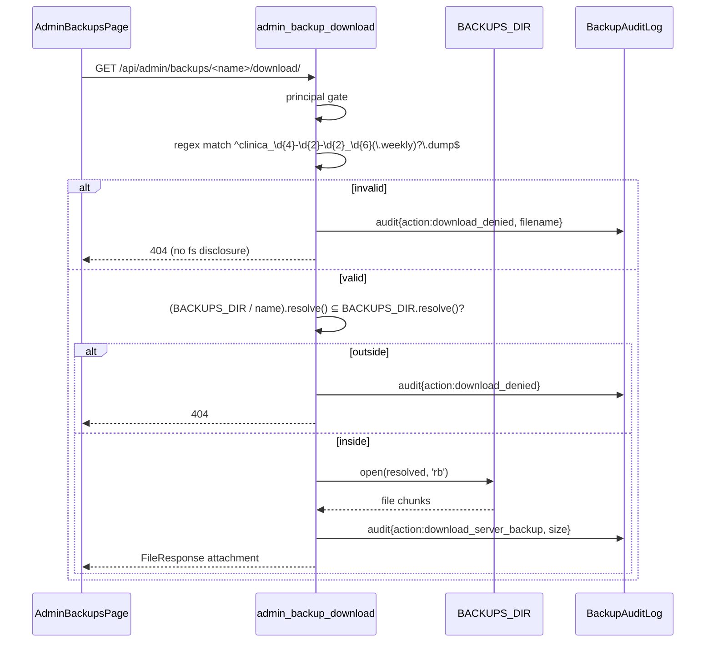

# Design: Admin Database Backups

## Technical Approach

Add a `backups` Django app (new) that owns the `BackupAuditLog` model, a `BackupService` module with the engine-branching dump/retention logic, four HTTP views (`trigger`, `list`, `download`, `delete`), one `create_backup` management command, and the URL wiring. The frontend adds a `/cms/backups` page that reuses `PageHeader` + `SectionCard` + `DataState` and a table modeled on `ReportTable`, with a new "Respaldos" nav group tagged `mainAdminOnly: true`. Operators schedule the same management command via host cron (Option A2 from exploration). All endpoints are gated by the existing `@_admin_principal_required` decorator (`backend/config/api_views.py:140-150`); all actions write an audit row through a new helper modeled on `_log_branch_admin_audit` (`api_views.py:239-246`).

## Architecture Decisions

### Decision: New `backups` Django app (not inline in `config/`)

| Option | Tradeoff | Decision |
|---|---|---|
| New `backend/backups/` app with `models.py`, `services.py`, `views.py`, `urls.py`, `management/commands/`, `tests/` | Owns its own migration, URL namespace, audit table, and management command; mirrors the `operations/` and `notifications/` precedent. | **Chosen** |
| Inline inside `backend/config/api_views.py` + `backend/config/models.py` | Matches the sprawling `api_views.py` (6149 lines) precedent, but mixes backup infra with dashboard, catalog, payment, and audit code. | Rejected — backups introduce new dependencies (subprocess, fs lock, retention) that warrant isolation. |
| Reuse `backend/operations/models.py` (where `BranchAdminAuditLog` lives) | Backups are NOT branch-scoped; mixing them with `BranchAdminAuditLog` would force an awkward global/branch split. | Rejected — proposal/spec explicitly call for a dedicated `BackupAuditLog`. |

### Decision: Engine branching via `settings.DATABASES["default"]["ENGINE"]`

| Option | Tradeoff | Decision |
|---|---|---|
| Dispatch on `DATABASES["default"]["ENGINE"]` (`django.db.backends.postgresql` vs `django.db.backends.sqlite3`) | Reuses the existing toggle (`settings.py:140-162`); no env plumbing. | **Chosen** |
| Dispatch on `USE_LOCAL_DB` boolean | Same effect, but couples to a project-local flag rather than the engine name. | Rejected — less honest about the actual backend. |

### Decision: Opaque IDs derived from filename, not DB row PKs

| Option | Tradeoff | Decision |
|---|---|---|
| Return `filename` directly as the list ID | Opaque to client (cannot inject path) and 1-to-1 with the filesystem entry; no second table to keep in sync. | **Chosen** |
| New `Backup` table with PK + filename | Adds migration and a sync point; offers no real isolation. | Rejected — naming convention + path resolution is sufficient defense. |

### Decision: `fcntl.flock` (POSIX) on a sentinel file in `BACKUPS_DIR`

| Option | Tradeoff | Decision |
|---|---|---|
| `fcntl.flock(LOCK_EX \| LOCK_NB)` on `BACKUPS_DIR/.lock` | Stdlib only; non-blocking probe prevents two simultaneous dumps; platform-specific but Linux is the only deployment target. | **Chosen** |
| `filelock` PyPI package | Cross-platform, but adds a dependency for a single VM. | Rejected — keep deps minimal. |
| Lock per filename | Race window between mtime check and write. | Rejected — coarse lock is fine (one dump at a time, by design). |

### Decision: Rate limiting via Django cache framework

| Option | Tradeoff | Decision |
|---|---|---|
| `cache.get` / `cache.set` with per-user key + TTL (already used at `api_views.py:186-196`) | Zero new dependencies; backend already configured. | **Chosen** |
| `django-ratelimit` decorator | More ergonomic but adds dependency. | Rejected — overkill for one trigger endpoint. |

### Decision: Streaming with `FileResponse(..., as_attachment=True)`

| Option | Tradeoff | Decision |
|---|---|---|
| Django `FileResponse` streaming the dump (no in-memory load) | Built-in; correct headers; no buffer pressure. | **Chosen** |
| Custom `StreamingHttpResponse` opening the file manually | Same outcome, more code. | Rejected. |

### Decision: Path-traversal defense via regex allowlist + `Path.resolve()` containment

| Option | Tradeoff | Decision |
|---|---|---|
| Regex `^clinica_\d{4}-\d{2}-\d{2}_\d{6}(\.weekly)?\.dump$` THEN `Path(BACKUPS_DIR) / filename; Path.resolve()` then assert `startswith(BACKUPS_DIR.resolve())` | Two layers: deny obvious garbage, deny residual `..` / absolute / symlink escapes. | **Chosen** |
| Only `resolve()` check | Rejected — relying on `resolve()` alone is brittle (symlinks still escape). |
| Allow any filename inside `BACKUPS_DIR` | Rejected — defeats the purpose; `resolve()` alone is the only defense. |

### Decision: Manual trigger vs scheduled — same code path

| Option | Tradeoff | Decision |
|---|---|---|
| Both call `BackupService.create_backup(actor="user:N" | "system:cron")` | One implementation; retention always runs after a successful create. | **Chosen** (per proposal Option A2) |
| Two separate implementations | Drift risk. | Rejected. |

## Module Layout

```
backend/
├── backups/                                 # NEW Django app
│   ├── __init__.py
│   ├── apps.py
│   ├── models.py                            # BackupAuditLog
│   ├── services.py                          # BackupService (dump, retention, lock, audit)
│   ├── views.py                             # trigger, list, download, delete
│   ├── urls.py                              # /api/admin/backups/*
│   ├── migrations/0001_backupauditlog.py
│   ├── management/commands/
│   │   └── create_backup.py                 # `python manage.py create_backup`
│   └── tests/
│       ├── __init__.py
│       ├── test_services.py
│       └── test_views.py
├── config/
│   ├── settings.py                          # +BACKUPS_DIR, BACKUP_*
│   └── api_urls.py                          # +backups/* block
frontend/aesthetic-clinic/src/
├── layouts/AdminLayout.tsx                  # + "Respaldos" nav group (mainAdminOnly)
├── pages/admin/backups/
│   ├── AdminBackupsPage.tsx                 # PageHeader + table + actions
│   ├── BackupTable.tsx                      # mirrors ReportTable
│   └── useBackups.ts                        # SWR-style loader
├── services/api/admin.ts                    # +list/trigger/download/deleteAdminBackup
└── types/admin.ts                           # +Backup type
frontend/aesthetic-clinic/tests/e2e/
└── admin_backups.spec.ts                    # role gate + happy path
scripts/
└── backup_cron.example                      # operator-facing cron line
docs/
└── backups.md                               # operator runbook
```

## Database Engine Branching — Exact Pattern

```python
# backend/backups/services.py
from django.conf import settings
from pathlib import Path
import subprocess, tempfile, shutil, fcntl, os

ENGINE = settings.DATABASES["default"]["ENGINE"]

def _dump_to_path(target: Path) -> None:
    target.parent.mkdir(parents=True, exist_ok=True)
    if ENGINE.endswith("postgresql"):
        env = {**os.environ, "PGPASSWORD": os.getenv("DJANGO_DB_PASSWORD", "")}
        subprocess.run(
            ["pg_dump", "-Fc", "--no-owner", "--no-privileges",
             "-h", os.getenv("DJANGO_DB_HOST", ""),
             "-p", os.getenv("DJANGO_DB_PORT", ""),
             "-U", os.getenv("DJANGO_DB_USER", ""),
             "-d", os.getenv("DJANGO_DB_NAME", ""),
             "-f", str(target)],
            env=env, check=True, timeout=1800,
        )
    elif ENGINE.endswith("sqlite3"):
        # sqlite3 .backup requires the CLI; fall back to safe copy
        subprocess.run(
            ["sqlite3", str(settings.BASE_DIR / "db.sqlite3"),
             f".backup '{target}'"],
            check=True, timeout=1800,
        )
    else:
        raise RuntimeError(f"Unsupported DB engine: {ENGINE}")
```

Rules:
- `subprocess.run(check=True, timeout=1800)` — non-zero exit raises `CalledProcessError`; timeout raises `TimeoutExpired`.
- Dumps write to a temp file first, then `Path.replace()` into the final name (atomic move on same filesystem). On failure the temp file is deleted.
- `PGPASSWORD` injected via `env=` only; never via command line (visible in `ps`).
- Stream-chunked output, no `shell=True`.

## Authentication, Authorization, and Audit

- Every view decorated with `@_admin_principal_required` (line 140) — same as existing principal-only writes (`api_views.py:4474`, `4634`, `4915`).
- New helper modeled on `_log_branch_admin_audit` (`api_views.py:239-246`):

```python
# backend/backups/services.py
def log_backup_audit(*, request, action, filename, metadata=None):
    from .models import BackupAuditLog
    with transaction.atomic():
        BackupAuditLog.objects.create(
            user=request.user if request.user.is_authenticated else None,
            action=action,
            filename=filename,
            ip_address=_client_ip(request),
            metadata=metadata or {},
        )
```

`BackupAuditLog` model (`backend/backups/models.py`):

```python
class BackupAuditLog(TimeStampedModel):
    class Action(models.TextChoices):
        TRIGGER_DOWNLOAD = "trigger_download", "Descarga manual"
        DOWNLOAD_SERVER_BACKUP = "download_server_backup", "Descargar respaldo"
        DELETE_SERVER_BACKUP = "delete_server_backup", "Eliminar respaldo"
        RETENTION_PRUNE = "retention_prune", "Retencion"
        RATE_LIMIT_DENIED = "rate_limit_denied", "Limite de velocidad"

    user = models.ForeignKey(settings.AUTH_USER_MODEL, on_delete=models.SET_NULL,
                             null=True, blank=True, related_name="backup_audit_logs")
    action = models.CharField(max_length=32, choices=Action.choices)
    filename = models.CharField(max_length=255, blank=True)
    ip_address = models.GenericIPAddressField(null=True, blank=True)
    metadata = models.JSONField(default=dict, blank=True)

    class Meta:
        db_table = "backup_audit_logs"
        ordering = ("-created_at",)
```

## Rate Limiting

```python
def _rate_limit(scope: str, user_id: int, ttl_seconds: int) -> bool:
    key = f"backup_ratelimit:{scope}:{user_id}"
    if cache.get(key):
        return False  # denied
    cache.set(key, 1, ttl_seconds)
    return True      # allowed
```

- Trigger: 1 / 60s per principal.
- Delete: 1 / 30s per principal.
- Denials write a `RATE_LIMIT_DENIED` audit row.

## Streaming Response

```python
# download view
from django.http import FileResponse

resolved = (Path(settings.BACKUPS_DIR) / filename).resolve()
if not str(resolved).startswith(str(Path(settings.BACKUPS_DIR).resolve())):
    return json_response({"detail": "No encontrado."}, status=404)

response = FileResponse(open(resolved, "rb"), as_attachment=True, filename=resolved.name)
response["Content-Type"] = "application/octet-stream"
response["Content-Length"] = str(resolved.stat().st_size)
return response
```

The file is opened lazily by `FileResponse` and chunked to the client without loading into memory.

## Path-Traversal Defense

1. URL param matches `^clinica_\d{4}-\d{2}-\d{2}_\d{6}(\.weekly)?\.dump$` — anything else → `400`.
2. `target = (BACKUPS_DIR / filename).resolve()` — rejects `..`, absolute prefixes.
3. `BACKUPS_DIR.resolve()` containment check — rejects symlinks pointing outside.
4. Failure path writes a `download_denied` audit row with the supplied `filename` (already validated for length) and returns `404` (no enumeration).

## Retention Algorithm

After every successful creation (UI or cron):

```python
def apply_retention(backups_dir: Path) -> list[Path]:
    daily, weekly = [], []
    for p in backups_dir.glob("clinica_*.dump"):
        (weekly if p.name.endswith(".weekly.dump") else daily).append(p)
    daily.sort(key=lambda p: p.stat().st_mtime, reverse=True)
    weekly.sort(key=lambda p: p.stat().st_mtime, reverse=True)
    pruned = []
    for old in daily[BACKUP_KEEP_DAILY:]:
        old.unlink(); pruned.append(old)
    for old in weekly[BACKUP_KEEP_WEEKLY:]:
        old.unlink(); pruned.append(old)
    return pruned
```

Constants in `settings.py`:
- `BACKUP_KEEP_DAILY` (default 7)
- `BACKUP_KEEP_WEEKLY` (default 4)

Each pruned file produces a `RETENTION_PRUNE` audit row.

## Concurrency Lock

```python
LOCK_PATH = Path(settings.BACKUPS_DIR) / ".lock"

def _with_dump_lock(fn):
    LOCK_PATH.parent.mkdir(parents=True, exist_ok=True)
    fd = os.open(LOCK_PATH, os.O_CREAT | os.O_RDWR, 0o600)
    try:
        fcntl.flock(fd, fcntl.LOCK_EX | fcntl.LOCK_NB)
        return fn()
    except BlockingIOError:
        raise BackupBusy()
    finally:
        os.close(fd)
```

Wraps the entire `dump → rename → audit → retention` sequence. The command path AND the UI trigger path acquire the same lock, so a manual trigger mid-cron is rejected with `409 Conflict`.

## HTTP Endpoints

All mounted under `/api/admin/backups/` in `backend/config/api_urls.py`:

| Method | Path | View | Decorator | Rate limit |
|---|---|---|---|---|
| `POST` | `trigger/` | `admin_backup_trigger` | `@_admin_principal_required` | 1/60s |
| `GET` | `` | `admin_backup_list` | `@_admin_principal_required` | none |
| `GET` | `<str:filename>/download/` | `admin_backup_download` | `@_admin_principal_required` | none |
| `DELETE` | `<str:filename>/` | `admin_backup_delete` | `@_admin_principal_required` | 1/30s |

All return `application/json` except `download` (streamed octet-stream). Trigger endpoint streams the freshly-created dump (no intermediate file is kept if the user is downloading it directly — written to a temp path and streamed; the same dump is NOT retained for the same request).

## Frontend

- **Nav**: new group in `AdminLayout.tsx` after `Reportes`:
  ```ts
  {
    label: 'Respaldos',
    mainAdminOnly: true,
    children: [
      { to: '/cms/backups', label: 'Respaldos de base de datos' },
    ],
  }
  ```
- **Route**: `<Route path="backups" element={<AdminBackupsPage />} />` inside the `/cms` subtree in `App.tsx` (between `reportes` and `catalogos`).
- **Page** (`AdminBackupsPage.tsx`): `PageHeader` (`eyebrow="Respaldos"`, title="Respaldos de base de datos") + `SectionCard` with a primary "Crear respaldo" button + the table inside.
- **Table** (`BackupTable.tsx`): mirrors `ReportTable.tsx`. Columns: `Nombre`, `Tamaño`, `Fecha (UTC)`, `Hace`, `Acciones` (`Descargar` / `Eliminar` buttons).
- **States**: `DataState` for loading / error / empty (`"Aún no hay respaldos generados. Pulsa 'Crear respaldo' para generar el primero."`).
- **Confirm modal (trigger)**:
  > "Se generará una descarga de la base de datos, esto puede tardar unos segundos. ¿Deseas continuar?"
  Buttons: `Cancelar` / `Crear y descargar`.
- **Confirm modal (delete)**:
  > "¿Eliminar el respaldo X? Esta acción no se puede deshacer."
  Buttons: `Cancelar` / `Eliminar`.
- **API client**: `listAdminBackups()`, `triggerAdminBackup()` (returns blob, triggers browser save), `deleteAdminBackup(filename)`. Download of an existing file is a plain `<a href="/api/admin/backups/<id>/download/" download>` with the session cookie — no extra CSRF token because it's a `GET`.

## Sequence Diagrams

### On-demand trigger flow



### Scheduled cron flow



Note: scheduled creates produce **no download** — file is left in `BACKUPS_DIR` for later retrieval.

### List flow



### Download flow with traversal rejection



## Deployment Notes (Operator Runbook)

- **Install `pg_dump`**: `apt-get install -y postgresql-client` (Debian/Ubuntu). Verify version: `pg_dump --version` ≥ server major version.
- **DB role permissions**: `DJANGO_DB_USER` must have `SELECT` on all schemas + `pg_read_all_data` (PG14+) OR be the schema owner. Document a one-line grant: `GRANT pg_read_all_data TO <role>;`.
- **`BACKUPS_DIR`** (settings): defaults to `/var/backups/clinica` on Linux. Mount on a separate volume when possible. `chown <django-user>: <BACKUPS_DIR>` + `chmod 700`. Never expose via nginx / static.
- **Suggested cron line** (`scripts/backup_cron.example`):
  ```
  0 3 * * * /usr/bin/env -i HOME=/ PATH=/usr/local/sbin:/usr/local/bin:/usr/sbin:/usr/bin:/sbin:/bin \
      /path/to/venv/bin/python /app/backend/manage.py create_backup \
      >> /var/log/clinica/backup.log 2>&1
  ```
- **systemd timer alternative** (preferred when the host has systemd): one `clinica-backup.service` (Type=oneshot) + `clinica-backup.timer` (`OnCalendar=*-*-* 03:00:00`). Cleaner logs, retries, `Persistent=true` to catch missed runs.
- **Disk-space gate**: refuse a dump if `shutil.disk_usage(BACKUPS_DIR).free < 2 * last_dump_size`. Emit a non-zero exit so cron alerts fire.
- **Restore is out of scope** — document `pg_restore --clean --if-exists -d <db> <dump>` in `docs/backups.md` for operators only.

## Testing Strategy

| Layer | What | How |
|---|---|---|
| Unit (backend) | `BackupService._dump_to_path` branches (mocked `subprocess.run`); regex match; resolve containment; retention sort + prune; lock contention (second `flock` raises `BlockingIOError`) | `python manage.py test backups.tests.test_services` |
| Integration (backend) | Authz matrix (anonymous → 401, `TRABAJADOR`/`ADMIN_SUCURSAL`/`CLIENTE` → 403, principal → 200) on all 4 endpoints; trigger rate-limit 429; delete rate-limit 429; path-traversal 404; download streams correct bytes; audit row counts; command exit codes | `python manage.py test backups.tests.test_views` |
| Command | `create_backup` happy path with sqlite engine (no `pg_dump` on CI); missing binary → exit 1 + audit row | Same test module |
| E2E (Playwright) | principal sees nav entry; branch admin does not; trigger modal → download; delete confirmation; empty state renders | `npx playwright test admin_backups.spec.ts` |
| Lint / type | `npm run lint`, `npx tsc --noEmit` | per `openspec/config.yaml` |

## File Changes Summary

| File | Action | Description |
|---|---|---|
| `backend/backups/{apps,models,services,views,urls}.py` | Create | New app: model, service, views, URL conf |
| `backend/backups/management/commands/create_backup.py` | Create | CLI entry point for cron |
| `backend/backups/migrations/0001_backupauditlog.py` | Create | `BackupAuditLog` table |
| `backend/backups/tests/{test_services,test_views}.py` | Create | Unit + integration |
| `backend/config/settings.py` | Modify | Add `BACKUPS_DIR`, `BACKUP_KEEP_DAILY`, `BACKUP_KEEP_WEEKLY`, `BACKUP_DUMP_TIMEOUT` |
| `backend/config/api_urls.py` | Modify | New `backups/` block (next to reports) |
| `frontend/.../layouts/AdminLayout.tsx` | Modify | Add "Respaldos" group (`mainAdminOnly: true`) |
| `frontend/.../App.tsx` | Modify | Route `/cms/backups` |
| `frontend/.../pages/admin/backups/*` | Create | Page, table, hook |
| `frontend/.../services/api/admin.ts` | Modify | `listAdminBackups`, `triggerAdminBackup`, `deleteAdminBackup` |
| `frontend/.../types/admin.ts` | Modify | `Backup` type |
| `frontend/.../tests/e2e/admin_backups.spec.ts` | Create | Principal gate + happy path |
| `scripts/backup_cron.example` | Create | Operator cron line |
| `docs/backups.md` | Create | Operator runbook (install pg_dump, retention, restore) |

## Migration / Rollout

No data migration. Rollout steps:
1. `python manage.py migrate` (creates `backup_audit_logs`).
2. Deploy code; operators run `manage.py create_backup` once manually to verify `pg_dump` works end-to-end.
3. Install cron / systemd timer.
4. Frontend ships nav entry behind `mainAdminOnly`; no DB impact.

Rollback: remove nav entry, unset cron, drop the migration + Django app registration; existing dump files on disk remain untouched (operator-controlled disposal).

## Open Questions

- **Weekly classification timing**: spec says weekly files exist; concrete rule is "file is `.weekly.dump` if created between 00:00 Saturday and 00:00 Monday in server timezone" — needs product sign-off.
- **`backup_user` role vs `DJANGO_DB_USER`**: should the dump use a dedicated read-only role with `pg_read_all_data`, or reuse the app role? Smaller blast radius if a read-only role is introduced; needs operator agreement.
- **`BACKUPS_DIR` default on Linux vs container**: container deployments may prefer `/data/backups`. Suggest making it env-only with a sensible default per platform; do not hard-code `/var/backups/clinica`.

## Next Step

Ready for `sdd-tasks` (break the design into tasks grouped by: backend app scaffold → service + lock → endpoints → management command → migration → frontend page → frontend nav → operator docs → tests).
